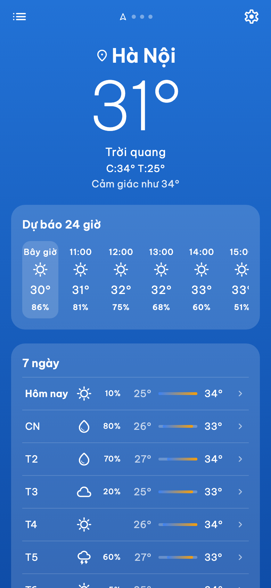
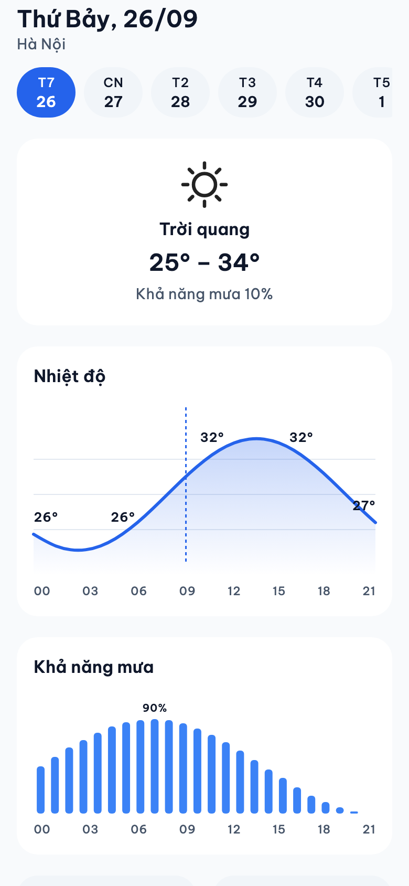
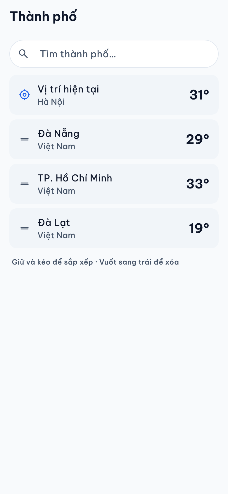
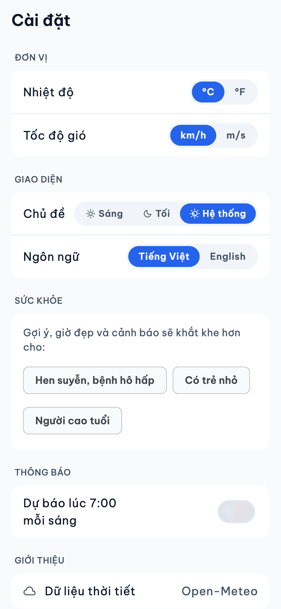
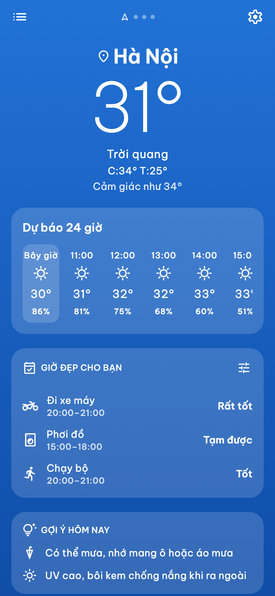
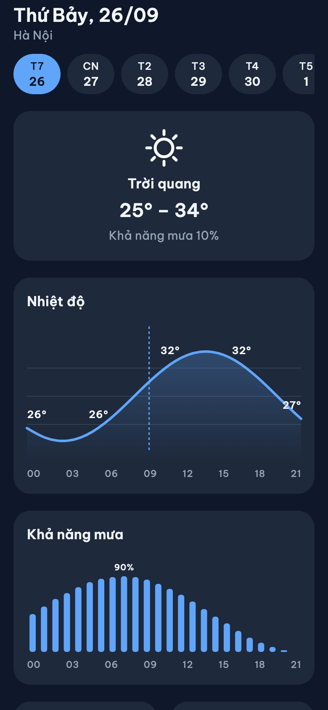
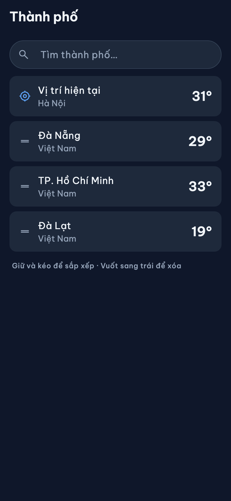
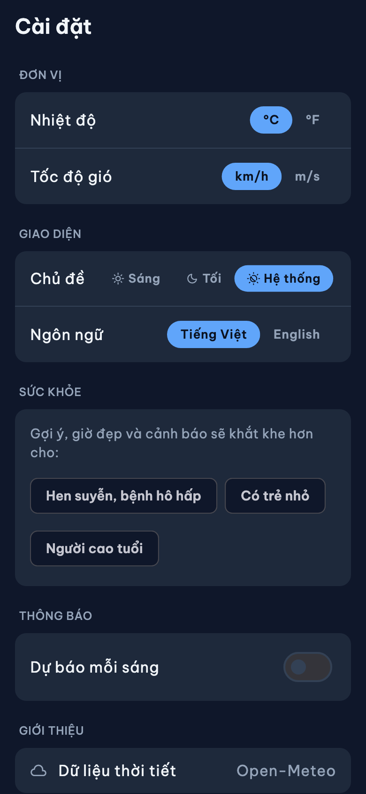
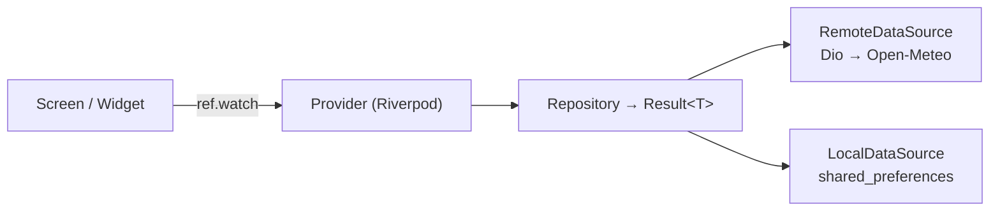

# Skycast 🌤️

[](https://github.com/TaiMinh2002/weather_application/actions/workflows/ci.yml)


Ứng dụng thời tiết viết bằng Flutter, dùng API miễn phí [Open-Meteo](https://open-meteo.com) (không cần API key). **0 đồng chi phí phát triển.**

Kế hoạch: [plan.md](plan.md) · Quy tắc code: [rule.md](rule.md) · Design: [`design/`](design/)

## Ảnh chụp

| | Home | Chi tiết ngày | Thành phố | Cài đặt | Onboarding |
|---|---|---|---|---|---|
| Sáng |  |  |  |  |  |
| Tối |  |  |  |  |  |

Ảnh được dựng từ code với dữ liệu mẫu (không cần simulator). Sau khi đổi UI, chạy lại:

```bash
flutter test tool/screenshots_test.dart --update-goldens
```

## Tính năng

- **Thời tiết hiện tại theo GPS**: nhiệt độ, cảm giác như, cao/thấp, nền gradient đổi theo thời tiết và ngày/đêm
- **Dự báo 24 giờ và 7 ngày**, kèm % khả năng mưa
- **Thông số chi tiết**: độ ẩm và điểm sương, gió và hướng gió, UV, áp suất, tầm nhìn, bình minh/hoàng hôn
- **Chất lượng không khí**: chỉ số US AQI kèm mức (Tốt → Nguy hại), thang màu EPA, PM2.5 và PM10
- **Chi tiết ngày**: biểu đồ nhiệt độ theo giờ, biểu đồ % mưa, gió và UV tối đa
- **Nhiều thành phố**: tìm kiếm (debounce), lưu, kéo thả sắp xếp, vuốt để xóa (có hoàn tác), vuốt ngang giữa các thành phố ở Home
- **Cài đặt**: °C/°F, km/h hoặc m/s, sáng/tối/theo hệ thống, Tiếng Việt/English
- **Offline**: mất mạng vẫn hiện dữ liệu gần nhất, kèm "cập nhật lúc…"
- **Đủ trạng thái**: skeleton khi tải, lỗi mạng/máy chủ có nút thử lại, từ chối quyền vị trí, GPS tắt
- Onboarding giải thích quyền vị trí trước khi hệ thống hỏi, splash native, dark mode từ đầu

**Hướng phát triển tiếp:** gợi ý hoạt động theo thời tiết, đồng bộ thành phố lên Supabase, thông báo dự báo mỗi sáng.

## Công nghệ

| Hạng mục | Lựa chọn |
|---|---|
| State management | Riverpod 3 (codegen `@riverpod`) |
| Router | go_router (redirect onboarding) |
| Network | dio, không tự viết interceptor |
| Model | freezed + json_serializable |
| Vị trí | geolocator + geocoding |
| Lưu trữ | shared_preferences (cài đặt, thành phố, cache thời tiết dạng JSON) |
| UI | Material 3, font Be Vietnam Pro, Material Symbols, skeletonizer; biểu đồ tự vẽ bằng `CustomPainter` |
| Đa ngôn ngữ | `flutter_localizations` + `.arb` (vi, en) |
| Test | flutter_test + mocktail |
| CI | GitHub Actions: analyze, test, build APK |

## Kiến trúc

Clean Architecture theo feature (`data` / `domain` / `presentation`). **Không có lớp usecase**: provider gọi thẳng repository.



**Luồng lỗi:** datasource bắt `DioException` và ném exception của app, repository bọc bằng `guard()` để trả `Result<T>` (`Ok` / `Err(Failure)`), UI dùng `.when(data, loading, error)`, còn `AppErrorView` lấy câu thông báo theo loại lỗi từ l10n.

**Dữ liệu:** có mạng thì gọi API và lưu cache. Mất mạng thì trả cache kèm thời điểm cập nhật. Không có cả hai thì báo lỗi.

```
lib/
├── core/          # network, error (Result/Failure), router, theme, storage, utils, widgets dùng chung
├── features/
│   ├── weather/   # dự báo + cache offline, màn Home và Chi tiết ngày
│   ├── location/  # GPS, quyền vị trí, tên địa điểm
│   ├── cities/    # tìm kiếm và quản lý thành phố
│   ├── settings/  # đơn vị, theme, ngôn ngữ
│   └── onboarding/
└── l10n/          # app_vi.arb, app_en.arb
```

## Chạy project

Cần Flutter 3.47+ (Dart 3.13+). File sinh ra (`*.g.dart`, `*.freezed.dart`, l10n) không commit, nên phải generate sau khi clone:

```bash
flutter pub get
```

```bash
flutter gen-l10n
```

```bash
dart run build_runner build --delete-conflicting-outputs
```

```bash
flutter run
```

Chạy test:

```bash
flutter test
```

## Tải APK

- **Bản phát hành:** trang [Releases](https://github.com/TaiMinh2002/weather_application/releases). Mỗi tag `v*` (ví dụ `v1.0.0`) tự build APK và đính kèm vào Release.
- **Bản mới nhất của `dev`:** tab [Actions](https://github.com/TaiMinh2002/weather_application/actions/workflows/ci.yml), chọn lần chạy mới nhất, tải artifact **skycast-apk**.

APK hiện ký bằng debug key: cài thử được, chưa đưa lên Play Store được.

## Credits

- Dữ liệu thời tiết và tìm kiếm địa điểm: [Open-Meteo](https://open-meteo.com) (CC BY 4.0)
- Font: [Be Vietnam Pro](https://github.com/bettergui/BeVietnamPro) (SIL Open Font License)
- Icon: [Material Symbols](https://fonts.google.com/icons) (Apache 2.0)
